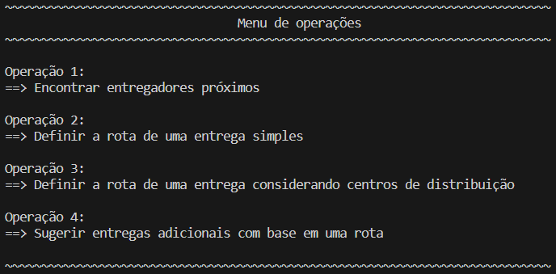

<h1 align="center">Soluções para auxiliar a operação da UrbanFast</h1>
<h2 align="center">Projeto e Análise de Algoritmos - Trabalho A2</h2>

<h3> Alunos criadores do repositório </h3>

<a href = "https://github.com/davilameireles"> Dávila de Carvalho Meireles <a/>
 
<a href = "https://github.com/gustavorrocha"> Gustavo Reis Rocha <a/>
 
<a href = "https://github.com/liviaverly"> Lívia Verly <a/>
 
<a href = "https://github.com/TFrankeM"> Thiago Franke Melchiors <a/>

<h3 align="center"> <b>Sobre o aplicativo</b> </h3>

<h3>Objetivo:</h3>

    O objetivo principal desta implementação é oferecer suporte às operações da UrbanFast, um inovador serviço de entregas. O aplicativo foi desenvolvido com o intuito de facilitar solicitações de clientes, colaboradores e operadores do negócio. A UrbanFast atua exclusivamente na cidade do Rio de Janeiro e utiliza uma representação digital da planta da cidade para otimizar suas rotas de entrega.

<h3>Inicialização:</h3>

    Certifique-se de fazer o download completo deste repositório. Para executar o programa, compile todos os arquivos <i>.cpp</i> usando o seguinte comando no terminal do seu computador:

	cd "/caminho/ate/o/diretorio/src/" && g++ -o main *.cpp; ./main
 

    Substitua <i>/caminho/ate/o/diretorio/src/</i> pelo caminho do diretório atual até a pasta "src".

<h3>Opções:</h3>

    O primeiro menu exibido oferece várias opções para simular a situação da cidade. Você pode variar a quantidade de ruas (arestas), vértices, esquinas, clientes, entregadores, vendedores e centrais de distribuição. Para selecionar uma opção, digite o número correspondente.

	 

    Após escolher o modo de simulação, você será redirecionado para o menu de operações. Para selecionar uma operação, digite o número correspondente:

	 

 
    Nenhuma biblioteca extra é necessária.

